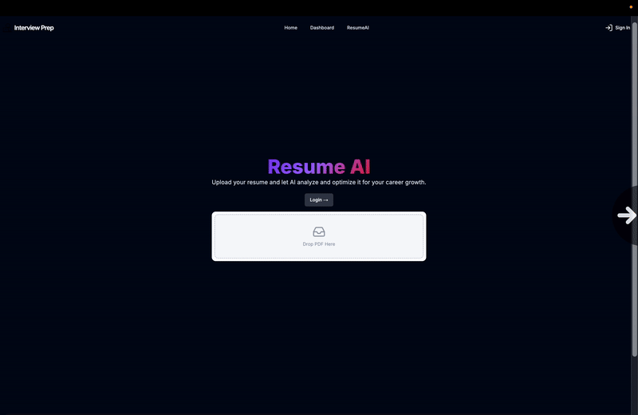

# InterviewPrep

**An AI‑powered mock interview platform** built with Next.js 14, Drizzle ORM, and Vercel that helps you sharpen both your behavioural and technical interviewing skills—with optional peer‑to‑peer practice.

<p align="center">
   &nbsp;&nbsp;&nbsp;
   &nbsp;&nbsp;&nbsp;
</p>
---

## 📌 Features

- **Resume Chat & Feedback**: Upload your résumé PDF to get context‑aware, line‑by‑line suggestions via a conversational AI powered by Google Gemini and Pinecone.
- **AI‑powered Mock Interviews**:
  - **Behavioural Rounds**: Gemini crafts 5 tailored behavioural questions; record yourself via webcam + speech‑to‑text and receive STAR‑format feedback and a numeric rating.
  - **Technical Rounds**: Solve 2 LeetCode‑style problems in an in‑browser Monaco Editor; batch‑submit your code for AI evaluation on correctness, efficiency, and style.
- **Peer‑to‑Peer Human Interviews**: Create or join live video rooms with shared résumé context and an optional collaborative code editor (Picture‑in‑Picture) for real‑time practice with peers.
- **Real‑time Chat & Feedback**: Stream Chat integration for live hints and post‑session aggregation of human + AI feedback.

---

## 🛠 Tech Stack

| Layer                 | Technology                     |
|-----------------------|--------------------------------|
| **Frontend**          | Next.js 14 App Router, React   |
| **UI**                | shadcn/ui, Tailwind CSS        |
| **State & Forms**     | TanStack Query, React Hook Form|
| **Auth**              | Clerk                          |
| **Database**          | Neon serverless Postgres, Drizzle ORM |
| **AI & Search**       | Google Gemini, Pinecone        |
| **File Storage**      | AWS S3 (presigned URLs)        |
| **Code Editor**       | Monaco Editor                  |
| **Media & STT**       | react‑webcam, MediaRecorder, react‑hook‑speech‑to‑text |
| **Video & Chat**      | Stream Chat / WebRTC           |
| **Deployment**        | Vercel (Edge Runtime)          |

---

## 🚀 Getting Started

### Prerequisites

- Node.js v18+  
- pnpm (recommended)  
- A Vercel account (for deployment)

### Installation

1. **Clone the repo**
   ```bash
   git clone https://github.com/itsnothuy/InterviewPrep.git
   cd InterviewPrep
   ```
2. **Install dependencies**
   ```bash
   pnpm install
   ```
3. **Configure environment variables**
   ```bash
   cp .env.sample .env.local
   ```
   Fill in the following keys in `.env.local`:
   - `NEXT_PUBLIC_DRIZZLE_DB_URL`
   - `NEXT_PUBLIC_S3_BUCKET_NAME`
   - `PINECONE_API_KEY`
   - (any other required secrets)

4. **Run locally**
   ```bash
   pnpm dev
   ```
   Open [http://localhost:3000](http://localhost:3000) in your browser.

---

## 📐 Architecture Overview

```
┌────────────┐            ┌────────────┐
│  Next.js   │ API Routes │   Gemini   │
│  (Vercel)  │──────────▶│ (Chat + Embeddings)
└────┬───────┘            └─────┬──────┘
     │                          │
     │ Drizzle (SQL Tags)       │
┌────▼───────┐          Vector  │
│   Neon     │◀────────Store───┘
│ PostgreSQL │          (Pinecone)
└────▲───────┘
     │  Presigned URLs
┌────┴───────┐
│   AWS S3   │  ← résumés, recordings
└────────────┘
```

All services run within Vercel’s edge network for minimal latency and seamless scaling.

---

## 🎯 Usage

- **Resume Chat**: Navigate to `/chat` to upload or select a résumé and start a contextual chat.
- **AI Mock Interview**: Go to `/ai/create-room` to set up a behavioural + technical interview session.
- **Peer Interviews**: Visit `/human-room-lobby` to create or join live video rooms with coding support.

---

## 📦 Deployment

1. Push your changes to GitHub.  
2. Import the repo in Vercel.  
3. Add the same environment variables to the Vercel project settings.  
4. Set **Edge Runtime** in `next.config.mjs`:  
   ```js
   export const runtime = 'edge';
   export const preferredRegion = 'home';
   ```
5. Trigger a deployment—Vercel handles CI/CD and domain configuration.

---

## 🤝 Contributing

Pull requests are welcome! Feel free to open issues or submit PRs for new features, bug fixes, or docs improvements.

---

## 📄 License

This project is open source under the [MIT License](LICENSE).

